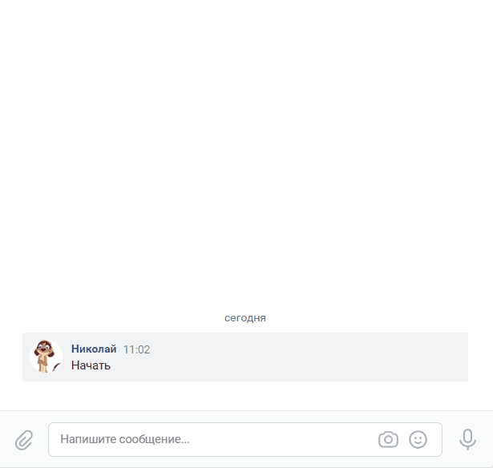

# Programming vacancies compare
This project presents the implementation of a chat bot for VK ([vk.com](https://vk.com))
and Telegram ( [telegram.org](https://web.telegram.org)). Chatbot for technical 
support for frequently recurring issues.
The algorithm for generating responses is based on the use of
[dialogflow](https://dialogflow.cloud.google.com/).

The project implements a notification about the launch of bots and stop due
to an error with the use of a special `bot` in telegrams


## How to install

For `tg_bot.py` you need to create a telegram bot using
[BotFather telegram](https://telegram.me/BotFather), there you need to get 
`TELEGRAM_TOKEN` for bot. You also need to create a `bot` that will send
error notification and write down the `TELEGRAM_LOG_TOKEN` key. Using `telegram bot`
[@userinfobot](https://t.me/userinfobot) needs to get your chat id 
`TELEGRAM_LOG_CHAT_ID` where notifications will be sent error notification.

For `vk_bot.py` 
you need to create a group in [vk](https://vk.com/groups) 
 and get a `VK_TOKEN` for group. 

You need to create a group in
[dialogflow](https://dialogflow.cloud.google.com) and connect to the project
[cloud.google](https://console.cloud.google.com) 
where it is necessary to generate a `.json` file containing the authorization key. 
Also in [cloud.google](https://console.cloud.google.com) you need to get
id of the project `GOOGLE_PROJECT_ID`

All keys are stored in the `.env` file which is: 
```
├── .env
├──  tg_bot.py
├──  vk_bot.py
└── intent.py
```

In the `.env` file, the keys are written as follows:

```python
TELEGRAM_TOKEN=[TOKEN]
TELEGRAM_LOG_TOKEN=[TOKEN]
TELEGRAM_LOG_CHAT_ID=[CHAT_ID]
GOOGLE_PROJECT_ID=[PROJECT_ID]
GOOGLE_APPLICATION_CREDENTIALS= path into json file
VK_TOKEN=[TOKEN]
```

To extract keys from `.env` file use:

```python
tg_token = os.getenv('TELEGRAM_TOKEN')
os.environ['GOOGLE_APPLICATION_CREDENTIALS']
```

```python
 vk_token = os.getenv('VK_TOKEN')
```

Python3 must already be installed. Then use pip (or pip3 if you have
conflict with Python3) to install dependencies:

```python
pip install -r requirements.txt
```


Use `intent.py` to train bots to respond to templates. With `intent.py`,
you can automatically load a template response in dialogflow from
`.json` file with dummy response templates. To do this, you need to specify 
the path to the file

```python
>intent.py -p 'google project_id' -f 'path to file' 
>intent.py -project 'google project_id' --file 'path to file'
```

The file structure looks like this:

``` python
{
    "intent 1": {
        "questions": [
            "question №1",
            "question №2",
            ,
            "question №n",
        ],
        "answer":"Text"
    }
    "intent 2": {
    .
    .
}
```
## Quick start
For a quick start in the console, just specify the `bot` file with 
`google project_id`.

```python
>tg_bot.py -p 'google project_id' 
>tg_bot.py --project 'google project_id'
```
```python
>vk_bot.py -p 'google project_id'  
>vk_bot.py --project 'google project_id'
```
## Project Goals
The code is written for educational purposes on online-course for 
web-developers [dvmn.org](https://dvmn.org).